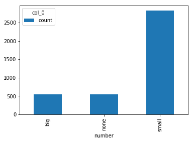
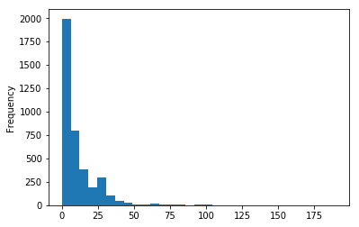
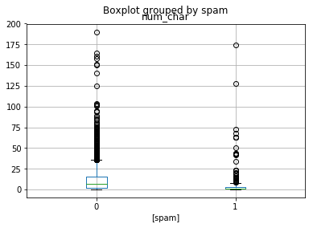
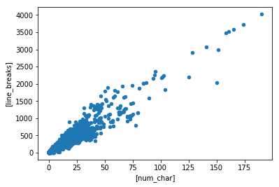

Introduction to Statistics
-------------------------


```python
import pandas as pd
%matplotlib inline
```


```python
url = "https://roualdes.us/data/email.csv"
email = pd.read_csv(url)
```


```python
# Check a variable's type with 'dtype'
email['spam'].dtype
```


    dtype('int64')


```python
# Instead of 'factor', in python think 'category'
email['spam'].astype('category').dtype
```


    CategoricalDtype(categories=[0, 1], ordered=False)


```python
# Numeric data is either 'int64' or 'float64', strings are called 'objects'
email.dtypes
```


    spam              int64
    to_multiple       int64
    from              int64
    cc                int64
    sent_email        int64
    time             object
    image             int64
    attach            int64
    dollar            int64
    winner           object
    inherit           int64
    viagra            int64
    password          int64
    num_char        float64
    line_breaks       int64
    format            int64
    re_subj           int64
    exclaim_subj      int64
    urgent_subj       int64
    exclaim_mess      int64
    number           object
    dtype: object


```python
phat = sum(email['spam'])/len(email['spam'])
phat == email['spam'].mean()
```


    True


```python
email['num_char'].mean()
```


    10.706586330017851


```python
email['num_char'].median()
```


    5.856


```python
email['num_char'].quantile([0.25, 0.5, 0.75])
```


    0.25     1.459
    0.50     5.856
    0.75    14.084
    Name: num_char, dtype: float64


```python
# Instead of 'summary', think 'describe'
email['num_char'].describe()
```


    count    3921.000000
    mean       10.706586
    std        14.645786
    min         0.001000
    25%         1.459000
    50%         5.856000
    75%        14.084000
    max       190.087000
    Name: num_char, dtype: float64


```python
email['num_char'].std()
```


    14.645785605588179


```python
Q1 = email['num_char'].quantile(.25)
Q3 = email['num_char'].quantile(.75)
IQR = Q3 - Q1
IQR
```


    12.625000000000002


```python
pd.crosstab(index=email['spam'], columns="count")
```


<div>
<style scoped>
    .dataframe tbody tr th:only-of-type {
        vertical-align: middle;
    }

    .dataframe tbody tr th {
        vertical-align: top;
    }

    .dataframe thead th {
        text-align: right;
    }
</style>
<table border="1" class="dataframe">
  <thead>
    <tr style="text-align: right;">
      <th>col_0</th>
      <th>count</th>
    </tr>
    <tr>
      <th>spam</th>
      <th></th>
    </tr>
  </thead>
  <tbody>
    <tr>
      <th>0</th>
      <td>3554</td>
    </tr>
    <tr>
      <th>1</th>
      <td>367</td>
    </tr>
  </tbody>
</table>
</div>


```python
# Crosstabs can be assigned to variables
spam_count = pd.crosstab(index=email['spam'], columns="count")

# Proportions
spam_count/spam_count.sum()
```


<div>
<style scoped>
    .dataframe tbody tr th:only-of-type {
        vertical-align: middle;
    }

    .dataframe tbody tr th {
        vertical-align: top;
    }

    .dataframe thead th {
        text-align: right;
    }
</style>
<table border="1" class="dataframe">
  <thead>
    <tr style="text-align: right;">
      <th>col_0</th>
      <th>count</th>
    </tr>
    <tr>
      <th>spam</th>
      <th></th>
    </tr>
  </thead>
  <tbody>
    <tr>
      <th>0</th>
      <td>0.906401</td>
    </tr>
    <tr>
      <th>1</th>
      <td>0.093599</td>
    </tr>
  </tbody>
</table>
</div>


```python
# Two-way tables
spam_num = pd.crosstab(index=email['spam'], columns=email['number'])

# Adding 'round(n)'
prop_table = spam_num/email['number'].count()
prop_table.round(2)
```


<div>
<style scoped>
    .dataframe tbody tr th:only-of-type {
        vertical-align: middle;
    }

    .dataframe tbody tr th {
        vertical-align: top;
    }

    .dataframe thead th {
        text-align: right;
    }
</style>
<table border="1" class="dataframe">
  <thead>
    <tr style="text-align: right;">
      <th>number</th>
      <th>big</th>
      <th>none</th>
      <th>small</th>
    </tr>
    <tr>
      <th>spam</th>
      <th></th>
      <th></th>
      <th></th>
    </tr>
  </thead>
  <tbody>
    <tr>
      <th>0</th>
      <td>0.13</td>
      <td>0.10</td>
      <td>0.68</td>
    </tr>
    <tr>
      <th>1</th>
      <td>0.01</td>
      <td>0.04</td>
      <td>0.04</td>
    </tr>
  </tbody>
</table>
</div>


```python
numbers = pd.crosstab(index=email['number'], columns="count")
numbers.plot.bar()
```


    <matplotlib.axes._subplots.AxesSubplot at 0x10733f400>





```python
# Histogram
email['num_char'].plot.hist()
```


    <matplotlib.axes._subplots.AxesSubplot at 0x1025af208>


```python
# Histogram w/ bins
email['num_char'].plot.hist(bins=31)
```


    <matplotlib.axes._subplots.AxesSubplot at 0x1026a0b38>





```python
email['num_char'].mean()
```


    10.706586330017851


```python
email['num_char'].median()
```


    5.856


```python
email.boxplot(column=['num_char'], by=['spam'])
```


    <matplotlib.axes._subplots.AxesSubplot at 0x106e22a58>





```python
email.plot.scatter(['num_char'], ['line_breaks'])
```


    <matplotlib.axes._subplots.AxesSubplot at 0x106319c88>




