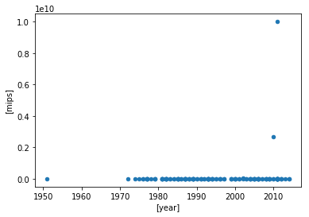
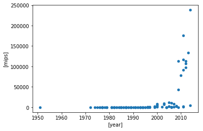
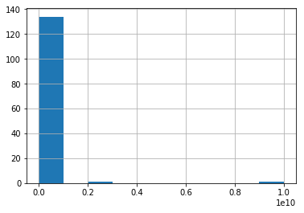

```python
import pandas as pd
```


```python
speed = pd.read_csv("https://roualdes.us/data/speed.csv")
speed.tail()
```


<div>
<style scoped>
    .dataframe tbody tr th:only-of-type {
        vertical-align: middle;
    }

    .dataframe tbody tr th {
        vertical-align: top;
    }

    .dataframe thead th {
        text-align: right;
    }
</style>
<table border="1" class="dataframe">
  <thead>
    <tr style="text-align: right;">
      <th></th>
      <th>system</th>
      <th>mips</th>
      <th>year</th>
      <th>cores</th>
    </tr>
  </thead>
  <tbody>
    <tr>
      <th>131</th>
      <td>Intel Core i7 3770K</td>
      <td>106924.0</td>
      <td>2012</td>
      <td>1</td>
    </tr>
    <tr>
      <th>132</th>
      <td>Intel Core i7 3630QM</td>
      <td>113093.0</td>
      <td>2012</td>
      <td>1</td>
    </tr>
    <tr>
      <th>133</th>
      <td>Intel Core i7 4770K</td>
      <td>133740.0</td>
      <td>2013</td>
      <td>1</td>
    </tr>
    <tr>
      <th>134</th>
      <td>Intel Core i7 5960X</td>
      <td>238310.0</td>
      <td>2014</td>
      <td>1</td>
    </tr>
    <tr>
      <th>135</th>
      <td>Raspberry Pi 2</td>
      <td>4744.0</td>
      <td>2014</td>
      <td>1</td>
    </tr>
  </tbody>
</table>
</div>


```python
speed.plot.scatter(['year'], ['mips'])
```


    <matplotlib.axes._subplots.AxesSubplot at 0x7fe00fce6160>





```python
# Instead of 'filter' think 'loc'
speed.loc[speed['cores'] == 1].plot.scatter(['year'], ['mips'])
```


    <matplotlib.axes._subplots.AxesSubplot at 0x7fe00fc57e80>





```python
speed['mips'].hist()
```


    <matplotlib.axes._subplots.AxesSubplot at 0x7fe00fc6cb00>





```python
speed['mips'].mean()
speed['mips'].median()
```


    146.35


```python
speed['mips'].std()
```


    885866969.6702679


```python
speed.loc[speed['cores'] == 1]['mips'].std()
```


    39920.26114530009


