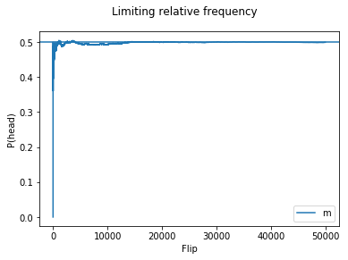

```python
import pandas as pd
import matplotlib.pyplot as plt
import numpy as np
```


```python
# sample space; T=0, H=1
S = pd.Series([0,1])

# 1 flip
outcome = S.sample(1)
outcome.mean()
```


    1.0


```python
# 100 flips; replications
outcome = S.sample(100, replace=True)
outcome.mean()
```


    0.54000000000000004


```python
# Coin flipping in Python
S.sample(1000, replace=True).mean()
```


    0.51100000000000001


```python
reps = 50000
# Need to use numpy to create an array
x = np.arange(1, reps+1) # Use arange instead of ':'
outcomes = S.sample(reps, replace=True)
flips = pd.DataFrame({'x':x, 'm':outcomes.cumsum()/x})
```


```python
flips.plot.line(x=['x'], y=['m'])

# 'plt' and functions come frome matplotlib
plt.axhline(y=0.5)
plt.suptitle('Limiting relative frequency')
plt.xlabel('Flip')
plt.ylabel('P(head)')
```


    Text(0,0.5,u'P(head)')




