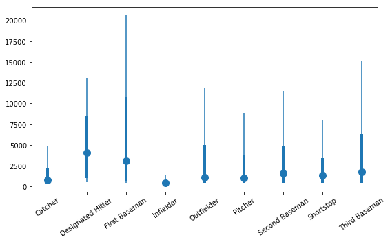
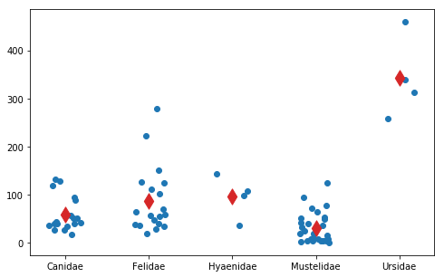

Analysis of Variance
-------------------


```python
import bplot as bp
import pandas as pd
import numpy as np
import matplotlib.pyplot as plt
import statsmodels.api as sm
from statsmodels.formula.api import ols
% matplotlib inline
```

$$H_0: \mu_1 = \mu_2 = \ldots = \mu_k$$

```python
mlb = pd.read_csv('https://roualdes.us/data/mlb.csv')
```


```python
fig, ax = plt.subplots(1, 1, figsize=(8, 5))
xlabs = []
for idx, (name, grp) in enumerate(mlb.groupby('position')):
    bp.box(idx, grp['salary'])
    xlabs.append(name)
plt.xticks(np.arange(idx+1), xlabs, rotation=35)
plt.tight_layout()
```





```python
model = ols('salary ~ C(position)', data=mlb).fit()
sm.stats.anova_lm(model, typ=3)
```


<div>
<style scoped>
    .dataframe tbody tr th:only-of-type {
        vertical-align: middle;
    }

    .dataframe tbody tr th {
        vertical-align: top;
    }

    .dataframe thead th {
        text-align: right;
    }
</style>
<table border="1" class="dataframe">
  <thead>
    <tr style="text-align: right;">
      <th></th>
      <th>sum_sq</th>
      <th>df</th>
      <th>F</th>
      <th>PR(&gt;F)</th>
    </tr>
  </thead>
  <tbody>
    <tr>
      <th>Intercept</th>
      <td>2.514391e+08</td>
      <td>1.0</td>
      <td>12.967129</td>
      <td>0.000336</td>
    </tr>
    <tr>
      <th>C(position)</th>
      <td>6.097532e+08</td>
      <td>8.0</td>
      <td>3.930746</td>
      <td>0.000142</td>
    </tr>
    <tr>
      <th>Residual</th>
      <td>1.588082e+10</td>
      <td>819.0</td>
      <td>NaN</td>
      <td>NaN</td>
    </tr>
  </tbody>
</table>
</div>


```python
carnivora = pd.read_csv('https://roualdes.us/data/carnivora.csv')
carnivs_idx = carnivora['Family'].isin(['Ailuridae', 'Procyonidae', 'Viverridae'])
carnivs = carnivora[~carnivs_idx]
```


```python
fig, ax = plt.subplots(1, 1, figsize=(8, 5))
xticklabs = []; xticks = []
for idx, (name, grp) in enumerate(carnivs.groupby('Family')):
    y = grp['SB']
    x = np.repeat(idx, y.shape[0])
    bp.jitter(x, y)
    xticklabs.append(name)
    xticks.append(idx)
ax = plt.xticks(xticks, xticklabs)
bp.point(np.array(xticks),
         carnivs.groupby('Family')['SB'].agg({'mean'})['mean'].values,
        color='tab:red', size=150, shape='d')
```


    <matplotlib.collections.PathCollection at 0x1155accf8>





```python
model = ols('SB ~ C(Family)', data=carnivs).fit()
sm.stats.anova_lm(model, typ=3)
```


<div>
<style scoped>
    .dataframe tbody tr th:only-of-type {
        vertical-align: middle;
    }

    .dataframe tbody tr th {
        vertical-align: top;
    }

    .dataframe thead th {
        text-align: right;
    }
</style>
<table border="1" class="dataframe">
  <thead>
    <tr style="text-align: right;">
      <th></th>
      <th>sum_sq</th>
      <th>df</th>
      <th>F</th>
      <th>PR(&gt;F)</th>
    </tr>
  </thead>
  <tbody>
    <tr>
      <th>Intercept</th>
      <td>63629.335556</td>
      <td>1.0</td>
      <td>26.766134</td>
      <td>2.091425e-06</td>
    </tr>
    <tr>
      <th>C(Family)</th>
      <td>354999.208772</td>
      <td>4.0</td>
      <td>37.333237</td>
      <td>1.083349e-16</td>
    </tr>
    <tr>
      <th>Residual</th>
      <td>166406.307694</td>
      <td>70.0</td>
      <td>NaN</td>
      <td>NaN</td>
    </tr>
  </tbody>
</table>
</div>


```python
# coefficients
model.params
```


    Intercept                   59.455556
    C(Family)[T.Felidae]        28.144444
    C(Family)[T.Hyaenidae]      36.444444
    C(Family)[T.Mustelidae]    -29.470556
    C(Family)[T.Ursidae]       282.869444
    dtype: float64


```python
carnivs.groupby('Family')['SB'].agg({'mean'})
```


<div>
<style scoped>
    .dataframe tbody tr th:only-of-type {
        vertical-align: middle;
    }

    .dataframe tbody tr th {
        vertical-align: top;
    }

    .dataframe thead th {
        text-align: right;
    }
</style>
<table border="1" class="dataframe">
  <thead>
    <tr style="text-align: right;">
      <th></th>
      <th>mean</th>
    </tr>
    <tr>
      <th>Family</th>
      <th></th>
    </tr>
  </thead>
  <tbody>
    <tr>
      <th>Canidae</th>
      <td>59.455556</td>
    </tr>
    <tr>
      <th>Felidae</th>
      <td>87.600000</td>
    </tr>
    <tr>
      <th>Hyaenidae</th>
      <td>95.900000</td>
    </tr>
    <tr>
      <th>Mustelidae</th>
      <td>29.985000</td>
    </tr>
    <tr>
      <th>Ursidae</th>
      <td>342.325000</td>
    </tr>
  </tbody>
</table>
</div>


```python
# fitted values
model.fittedvalues
```


    0       72.844444
    1       28.844444
    2       -7.655556
    3       -2.655556
    4       69.544444
    5       35.544444
    6      -23.955556
    7      -15.955556
    8      -33.655556
    9      -25.955556
    10     -42.155556
    11     -32.655556
    12     -18.655556
    13      -7.955556
    14     -19.455556
    15     -17.655556
    16      60.544444
    17     -18.955556
    18      -4.025000
    19     -83.325000
    20     117.175000
    21     -29.825000
    27     -25.985000
    28     -27.985000
    29     -28.985000
    30     -25.985000
    31     -25.485000
    32     -23.235000
    33     -21.485000
    34     -21.485000
              ...
    50     -24.985000
    51      12.015000
    52      22.815000
    53      10.015000
    54      35.015000
    55      65.015000
    56      95.515000
    89       1.900000
    90      11.100000
    91      47.600000
    92     -60.600000
    93     -50.100000
    94     -51.300000
    95     -48.300000
    96     -30.800000
    97     -58.300000
    98     -68.600000
    99     -41.100000
    100    -32.300000
    101     37.900000
    102    -23.800000
    103    -53.600000
    104    -17.600000
    105    -29.300000
    106    135.900000
    107    191.700000
    108     37.900000
    109     63.900000
    110     14.400000
    111     23.400000
    Length: 75, dtype: float64


```python
# residuals
model.resid
```


    0       72.844444
    1       28.844444
    2       -7.655556
    3       -2.655556
    4       69.544444
    5       35.544444
    6      -23.955556
    7      -15.955556
    8      -33.655556
    9      -25.955556
    10     -42.155556
    11     -32.655556
    12     -18.655556
    13      -7.955556
    14     -19.455556
    15     -17.655556
    16      60.544444
    17     -18.955556
    18      -4.025000
    19     -83.325000
    20     117.175000
    21     -29.825000
    27     -25.985000
    28     -27.985000
    29     -28.985000
    30     -25.985000
    31     -25.485000
    32     -23.235000
    33     -21.485000
    34     -21.485000
              ...
    50     -24.985000
    51      12.015000
    52      22.815000
    53      10.015000
    54      35.015000
    55      65.015000
    56      95.515000
    89       1.900000
    90      11.100000
    91      47.600000
    92     -60.600000
    93     -50.100000
    94     -51.300000
    95     -48.300000
    96     -30.800000
    97     -58.300000
    98     -68.600000
    99     -41.100000
    100    -32.300000
    101     37.900000
    102    -23.800000
    103    -53.600000
    104    -17.600000
    105    -29.300000
    106    135.900000
    107    191.700000
    108     37.900000
    109     63.900000
    110     14.400000
    111     23.400000
    Length: 75, dtype: float64
