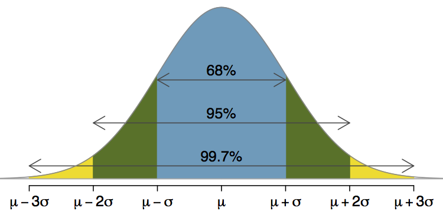

Due date: 2016-09-16

1. Consider the following discrete random variable.
    a. What is the expected value and the standard deviation of the random variable described in the following table?
    b. What if we changed the units of x to x/4.  Repeat part a.

------ --- --- --- ---
x        1   2   3   4

P(X=x) 0.4 0.3 0.2 0.1
------ --- --- --- ---

2. The following plot depticts the 68, 95, 99.7 rule.  Provide the R code to justify this rule.  (Hint: use pnorm.)

3. Suppose adult heights are distributed normally with a mean of 70 inches and a standard deviation of 4 inches.
    a. What is the probability we randomly select an adult who is between 64 and 78 inches tall?
    b. What is the probability we randomly select an adult who is less than 62.5 inches tall?
    c. What is the probability we randomly select an adult who is greater than 71.26 inches tall?
    d. What is the height of the shortest 31% of adults?
    e. What is the height of the tallest 5% of adults?

5. Assume X~U(a, b) is a continuous random variable.  Calculate the expected value of the random variable X.  Provide your work.